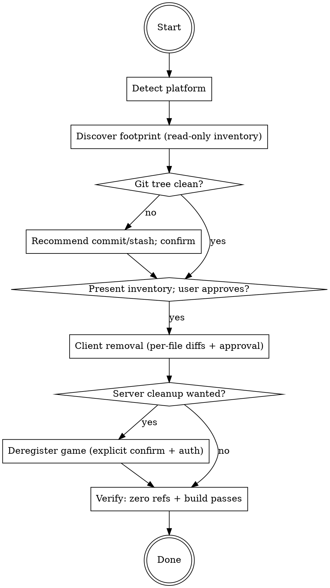

# MoonForge Uninstall Skill Implementation Plan

> **For agentic workers:** REQUIRED SUB-SKILL: Use superpowers:subagent-driven-development (recommended) or superpowers:executing-plans to implement this plan task-by-task. Steps use checkbox (`- [ ]`) syntax for tracking.

**Goal:** Add a `/moonforge-uninstall` skill that removes all MoonForge client instrumentation from a Unity or web game (leaving it buildable) with an opt-in server deregistration.

**Architecture:** One new skill folder `skills/moonforge-uninstall/` following the package's platform-router pattern: `SKILL.md` detects the platform and loads `references/unity.md` or `references/web.md`. Markdown only — no SDK code changes. Orchestrator + README gain a pointer.

**Tech Stack:** Markdown skill content; structural verification via `grep`/`test`. The repo's existing vitest suite (25/26 tests) must stay green (untouched).

## Global Constraints

- Skill flow (from the spec, in order): Detect platform → Discover footprint (read-only inventory) → Confirm + git safety → Client removal (per-file diffs + approval) → opt-in Server cleanup → Verify.
- Platform detection rules identical to the other skills: Unity = `Assets/` + `ProjectSettings/ProjectSettings.asset`; Web = `package.json` game-framework dep (`phaser`, `pixi.js`, `three`, `@babylonjs/core`, `playcanvas`, `kaboom`, `excalibur`, `matter-js`) or `index.html` referencing a game bundle / `<canvas>`; Unreal → not supported; ambiguous → ask.
- **Value-using references are never auto-deleted** — flagged with file:line for manual review.
- Git safety: recommend clean tree (commit/stash) before removal; proceed only on user confirmation.
- Server cleanup: opt-in, explicit second confirmation, requires a MoonForge auth token; calls `DELETE {app_base}/api/games/{gameId}`; MUST state that raw collected events are retained (purge is out of scope).
- Verify step: zero remaining MoonForge references (except explicitly kept flagged ones) + the project still builds.
- Exclude `node_modules/`, build output (`dist/`, `build/`, `.next/`, `Library/`, `Temp/`), and `.git/` from all discovery greps.

---

### Task 1: `moonforge-uninstall` skill router + web reference

**Files:**
- Create: `skills/moonforge-uninstall/SKILL.md`
- Create: `skills/moonforge-uninstall/references/web.md`

**Interfaces:**
- Produces: the `moonforge-uninstall` skill (frontmatter `name: moonforge-uninstall`) and the router contract "load `references/<platform>.md`" that Task 2's unity.md plugs into.

- [ ] **Step 1: Write `skills/moonforge-uninstall/SKILL.md`**

```markdown
---
name: moonforge-uninstall
description: Use when removing MoonForge analytics and error tracking from a Unity or web game — inventories every SDK file and tracking call, removes them with reviewable diffs, optionally deregisters the game server-side, and verifies the game still builds
---

# MoonForge Uninstall

## Overview

Cleanly removes ALL MoonForge instrumentation from a game project: the SDK
files, the init/bootstrap wiring, every analytics and error-tracking call, and
`.moonforge.json` — leaving the game buildable. Optionally deregisters the game
from the MoonForge dashboard. The reverse of `/moonforge`.

## When to Use

- User says "remove MoonForge", "uninstall analytics", or `/moonforge-uninstall`
- A trial or churned customer wants MoonForge fully out of their codebase
- A developer is reverting an instrumentation experiment

## Process Flow



## Platform routing

1. Determine the platform:
   - **Unity** — `Assets/` and `ProjectSettings/ProjectSettings.asset` present.
   - **Web** — `package.json` with a game framework dependency (`phaser`, `pixi.js`,
     `three`, `@babylonjs/core`, `playcanvas`, `kaboom`, `excalibur`, `matter-js`),
     or an `index.html` referencing a game bundle / `<canvas>`.
   - **Unreal** — not supported (no install support yet, so nothing to uninstall).
   - Ambiguous (both present): ask the user which to uninstall from.
2. Read `.moonforge.json` (if present) to capture `gameId`/`gameName` for the
   optional server step — BEFORE it gets deleted.
3. Load and follow the matching reference for the rest of this skill:
   - Unity → `references/unity.md`
   - Web → `references/web.md`

## Universal rules (both platforms)

- **Inventory first, touch nothing.** Grep the project (excluding `node_modules/`,
  `dist/`, `build/`, `.next/`, `Library/`, `Temp/`, `.git/`) and present a
  structured inventory: SDK files, config, init wiring, every call site.
- **Git safety.** If `git status` shows a dirty tree, recommend the user commit or
  stash first so the removal is one reviewable, revertible diff. Proceed only on
  explicit confirmation.
- **Value-using references are NEVER auto-deleted.** A statement like
  `MoonForgeAnalytics.trackEvent(...)` is a side-effect call — safe to delete. But
  any reference whose RETURN VALUE is used (assigned, passed, returned, awaited
  into a variable — e.g. `const id = MoonForgeAnalytics.getDistinctId()`) changes
  program behavior if removed. Flag these with file:line in a "manual review"
  list and leave them in place unless the user resolves them.
- **Per-file diffs.** Show each file's change and get approval before applying,
  exactly like `/moonforge`'s implement flow.

## Server cleanup (opt-in)

Only offer if a `gameId` is known. Requires BOTH:
1. An explicit second confirmation (this is destructive and irreversible).
2. A MoonForge auth token (Bearer). If none is available, do NOT attempt the
   call — print the manual alternative instead (delete the game from the
   MoonForge dashboard, or run the curl below with a token).

```bash
curl -X DELETE "https://moonforge.co/api/games/<GAME_ID>" \
  -H "Authorization: Bearer <TOKEN>"
```

**Be explicit with the user:** this deregisters the game from the account and
dashboard. **Raw events already collected are retained** in the analytics store —
purging them is a separate owner-side operation this skill does not perform.

## Verify (always the last step)

1. Grep the project again — expect ZERO MoonForge references
   (`MoonForge`, `moonforge`) outside any flagged value-using references the user
   explicitly chose to keep. `.moonforge.json` and the SDK files must be gone.
2. Build check per platform (see the reference file) — the game must still build.
3. Present a removal summary: files deleted, call sites removed, flagged items
   kept, server deregistration status.
```

- [ ] **Step 2: Write `skills/moonforge-uninstall/references/web.md`**

```markdown
# MoonForge Uninstall — Web

## 1. Discover the footprint (read-only)

Run these from the project root (exclude `node_modules/`, `dist/`, `build/`,
`.next/`, `.git/`):

```bash
# SDK files (module folder or legacy global bundle)
find . -path ./node_modules -prune -o -type d -name "moonforge" -print
find . -path ./node_modules -prune -o -type f -name "moonforge*.js" -print

# Init wiring, imports, script tags
grep -rn "MoonForgeAnalytics.init\|from ['\"].*moonforge\|import.*MoonForge" --include="*.js" --include="*.ts" --include="*.jsx" --include="*.tsx" --include="*.html" . | grep -v node_modules

# Every call site (analytics + errors)
grep -rn "MoonForgeAnalytics\.\|MoonForgeErrorTracker\." --include="*.js" --include="*.ts" --include="*.jsx" --include="*.tsx" --include="*.html" . | grep -v node_modules

# Config
ls .moonforge.json 2>/dev/null
```

Present the inventory grouped as: **SDK files** / **bootstrap wiring** /
**analytics calls** / **error-tracking calls** / **config**. Classify each call
site as *side-effect* (deletable) or *value-using* (flag for manual review —
e.g. `getDistinctId()`, `getSessionId()`, `getGameState()`, `getBreadcrumbs()`
results that are assigned or passed onward).

## 2. Remove (per-file diffs, approval each)

- Delete the SDK: the copied module folder (e.g. `src/moonforge/` containing
  `core.js`, `context.js`, `analytics.js`, `errors.js`, `index.js`) or the
  single `moonforge.global.js` / `js/moonforge.js`.
- Entry HTML: remove the `<script src=".../moonforge...js"></script>` tag and any
  inline `<script>MoonForgeAnalytics.init({...})</script>` block.
- Bootstrap file: remove the `import { MoonForgeAnalytics } ...` line and the
  `MoonForgeAnalytics.init({...})` statement.
- Each side-effect call statement (`trackEvent`, `trackScreenView`, `identify`,
  `setUserProperty`, `addBreadcrumb`, `captureException`, `captureMessage`,
  `captureNetworkError`, `setUser`, `setGameState`, ...): delete the statement
  line(s). If a surrounding block becomes empty (e.g. a now-empty `try/catch`
  or handler), clean it up and show that in the diff.
- Delete `.moonforge.json`.
- Leave every flagged value-using reference in place; list them at the end.

## 3. Verify

```bash
# Zero references (report any hits with file:line)
grep -rn -i "moonforge" --include="*.js" --include="*.ts" --include="*.jsx" --include="*.tsx" --include="*.html" --include="*.json" . | grep -v node_modules

# Build still passes — use what the project has, in this order:
npm run build          # if a build script exists
npx tsc --noEmit       # if tsconfig.json exists
node --check <each modified .js file>   # fallback
```

If the build fails on a removal-related error, show the error, fix the removal
(not the game logic), and re-verify.

## Common mistakes

- Deleting a `const x = MoonForge...` line whose variable is used later (breaks
  the build) — that is exactly what the value-using flag is for.
- Missing the inline `init` `<script>` block in the entry HTML of legacy games.
- Forgetting `.moonforge.json` or the `moonforge/` folder itself.
- Grepping inside `node_modules/` or `dist/` and "finding" bundled copies.
```

- [ ] **Step 3: Structural checks**

Run:
```bash
test -s skills/moonforge-uninstall/SKILL.md || { echo "MISSING SKILL.md"; exit 1; }
test -s skills/moonforge-uninstall/references/web.md || { echo "MISSING web.md"; exit 1; }
grep -q "name: moonforge-uninstall" skills/moonforge-uninstall/SKILL.md || { echo "bad frontmatter"; exit 1; }
grep -q "references/unity.md" skills/moonforge-uninstall/SKILL.md || { echo "router missing unity"; exit 1; }
grep -q "references/web.md" skills/moonforge-uninstall/SKILL.md || { echo "router missing web"; exit 1; }
grep -q "raw events already collected are retained" skills/moonforge-uninstall/SKILL.md || { echo "missing retention disclosure"; exit 1; }
grep -qi "value-using" skills/moonforge-uninstall/references/web.md || { echo "web.md missing value-using rule"; exit 1; }
echo OK
```
Expected: `OK`

- [ ] **Step 4: Commit**

```bash
git add skills/moonforge-uninstall/SKILL.md skills/moonforge-uninstall/references/web.md
git commit -m "feat(skills): add /moonforge-uninstall router and web removal guide"
```

---

### Task 2: Unity uninstall reference

**Files:**
- Create: `skills/moonforge-uninstall/references/unity.md`

**Interfaces:**
- Consumes: the router contract from Task 1 (`SKILL.md` loads `references/unity.md` for Unity).

- [ ] **Step 1: Write `skills/moonforge-uninstall/references/unity.md`**

```markdown
# MoonForge Uninstall — Unity

## 1. Discover the footprint (read-only)

Run these from the Unity project root (never scan `Library/`, `Temp/`, `.git/`):

```bash
# SDK package: UPM entry and/or embedded package
grep -n "moonforge\|MoonForge" Packages/manifest.json 2>/dev/null
find Packages Assets -maxdepth 3 -type d -iname "*MoonForge*" 2>/dev/null

# Settings asset (+ its .meta)
find Assets -name "MoonForgeSettings*" -not -path "*/Library/*" 2>/dev/null

# Using directives and every call site
grep -rn "using MoonForge" Assets/ --include="*.cs"
grep -rn "MoonForgeAnalytics\.\|MoonForgeErrorTracker\.\|NetworkErrorInterceptor\.\|SendWithTracking" Assets/ --include="*.cs"

# Bootstrap initialize
grep -rn "MoonForgeErrorTracker.Initialize" Assets/ --include="*.cs"

# Config
ls .moonforge.json 2>/dev/null
```

Present the inventory grouped as: **SDK package** / **settings asset** /
**bootstrap wiring** / **analytics calls** / **error-tracking calls** /
**network tracking** / **config**. Classify each call site as *side-effect*
(deletable) or *value-using* (flag for manual review — e.g.
`MoonForgeAnalytics.GetDistinctId()` assigned to a variable, or a tracked
request object reused afterward).

## 2. Remove (per-file diffs, approval each)

- SDK package: remove the MoonForge entry from `Packages/manifest.json` (and
  `Packages/packages-lock.json` if present); delete an embedded
  `MoonForge.ErrorTracking` package folder (with `.meta` files) if the SDK was
  vendored under `Packages/` or `Assets/`.
- Delete the `MoonForgeSettings` asset and its `.meta` file.
- In each instrumented `.cs` file: remove `using MoonForge.ErrorTracking;`,
  `using MoonForge.ErrorTracking.Analytics;`, `using MoonForge.ErrorTracking.Capture;`;
  remove the bootstrap `MoonForgeErrorTracker.Initialize(config)` statement and
  the `[SerializeField] private ErrorTrackerConfig config;` field if now unused;
  delete each side-effect call statement. Revert `request.SendWithTracking()`
  back to `request.SendWebRequest()` (the untracked original) rather than
  deleting the send.
- Delete `.moonforge.json`.
- Leave every flagged value-using reference in place; list them at the end.

## 3. Verify

```bash
# Zero references (report any hits with file:line)
grep -rn -i "moonforge" Assets/ Packages/ --include="*.cs" --include="*.json" --include="*.asmdef" 2>/dev/null

# Compile check — same approach as /moonforge-verify:
# open the project in Unity (or run Unity batch-mode compile) and confirm no
# compiler errors; at minimum confirm no orphaned references remain via the grep.
```

If compilation fails on a removal-related error (usually an orphaned `using` or
a deleted variable still referenced), fix the removal and re-verify.

## Common mistakes

- Deleting `SendWithTracking()` entirely instead of reverting to
  `SendWebRequest()` — the request must still be sent.
- Removing a `using` directive while a flagged value-using call remains in the
  file (compile error).
- Forgetting `.meta` files (Unity regenerates GUID churn) or the
  `packages-lock.json` entry.
- Scanning `Library/`/`Temp/` caches.
```

- [ ] **Step 2: Structural checks**

Run:
```bash
test -s skills/moonforge-uninstall/references/unity.md || { echo "MISSING unity.md"; exit 1; }
grep -q "SendWebRequest" skills/moonforge-uninstall/references/unity.md || { echo "missing SendWithTracking revert rule"; exit 1; }
grep -qi "value-using" skills/moonforge-uninstall/references/unity.md || { echo "missing value-using rule"; exit 1; }
grep -q "MoonForgeSettings" skills/moonforge-uninstall/references/unity.md || { echo "missing settings asset removal"; exit 1; }
echo OK
```
Expected: `OK`

- [ ] **Step 3: Commit**

```bash
git add skills/moonforge-uninstall/references/unity.md
git commit -m "feat(skills): add Unity removal guide for /moonforge-uninstall"
```

---

### Task 3: Docs pointers + final verification

**Files:**
- Modify: `skills/moonforge/SKILL.md` (add uninstall pointer to the Quick Reference table)
- Modify: `README.md` (document the uninstall skill)

- [ ] **Step 1: Add the orchestrator pointer**

In `skills/moonforge/SKILL.md`, find the "## Quick Reference" table and add one row after the `moonforge-verify` row:

```markdown
| moonforge-uninstall | Remove all MoonForge instrumentation | `/moonforge-uninstall` |
```

- [ ] **Step 2: Document in README**

In `README.md`, add one row to the "Skills Included" table:

```markdown
| **Uninstall** | `/moonforge-uninstall` | Remove all MoonForge code from a game (SDK, calls, config), optional server deregistration |
```

And after the Web games subsection, add:

```markdown
### Uninstalling

`/moonforge-uninstall` reverses `/moonforge`: it inventories every MoonForge file
and tracking call in the project, removes them with reviewable diffs (git-safe),
optionally deregisters the game from your MoonForge account, and verifies the
game still builds. Already-collected analytics data is retained server-side.
```

- [ ] **Step 3: Final verification**

Run:
```bash
grep -q "moonforge-uninstall" skills/moonforge/SKILL.md || { echo "orchestrator pointer missing"; exit 1; }
grep -q "moonforge-uninstall" README.md || { echo "README missing"; exit 1; }
npm test 2>&1 | tail -3   # existing SDK suite must stay green (26 tests)
echo OK
```
Expected: tests pass (26), `OK`.

- [ ] **Step 4: Commit**

```bash
git add skills/moonforge/SKILL.md README.md
git commit -m "docs: document /moonforge-uninstall in orchestrator and README"
```

## Self-Review

- **Spec coverage:** router + flow + universal rules incl. git safety and value-using flag (Task 1 SKILL.md) ✓; web discovery/removal/verify (Task 1 web.md) ✓; unity discovery/removal/verify incl. SendWithTracking revert + .meta/manifest handling (Task 2) ✓; server cleanup opt-in with token, curl, retention disclosure (Task 1 SKILL.md) ✓; verify = zero refs + build (both references) ✓; orchestrator/README pointers (Task 3) ✓; gameId captured before `.moonforge.json` deletion (SKILL.md routing step 2) ✓.
- **Placeholders:** none — all markdown content authored verbatim; `<GAME_ID>`/`<TOKEN>` are intentional user values.
- **Consistency:** platform rules match the existing routers verbatim; method names match the real SDK surface; flow order matches the spec.
