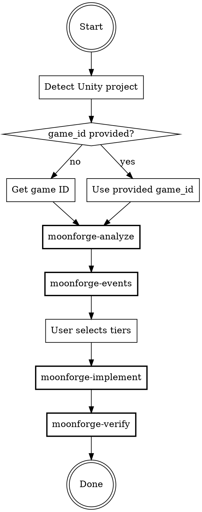

# MoonForge Analytics Instrumentation

## Overview

Interactive agent that guides Unity developers through analytics instrumentation. Analyzes the game, recommends events by priority tier, writes TrackEvent calls, and verifies everything works.

## When to Use

- User wants to add analytics events to their Unity game
- User says "instrument my game" or "add analytics" for a Unity project
- Another agent receives a game ID and needs to add analytics

## Arguments

- **game_id** (optional): Pass directly to skip game detection. Example: `/moonforge 550e8400-e29b-41d4-a716-446655440000`

## Process Flow



### Step 1: Detect Project

Look for Unity project markers in the current directory:
- `Assets/` directory
- `ProjectSettings/ProjectSettings.asset`

If not found, ask the user for the Unity project path.

### Step 2: Get Game ID

Priority order:
1. Passed as argument to this skill
2. Read from `.moonforge.json` if present in project root
3. Ask the user for their MoonForge game ID

### Step 3: Analyze

**REQUIRED SUB-SKILL:** Use moonforge-analyze

Scan the project and present the game profile to the user.

### Step 4: Recommend Events

**REQUIRED SUB-SKILL:** Use moonforge-events

Present tiered event recommendations. Wait for user to select tiers.

### Step 5: Implement

**REQUIRED SUB-SKILL:** Use moonforge-implement

For each event in selected tiers, find the right file and method, write the TrackEvent call, and show diff for approval.

### Step 6: Verify

**REQUIRED SUB-SKILL:** Use moonforge-verify

Run compilation check, static analysis, and present event inventory.

## Quick Reference

| Sub-Skill | Purpose | Invocation |
|-----------|---------|------------|
| moonforge-analyze | Scan project structure | `/moonforge:analyze` |
| moonforge-events | Recommend events by tier | `/moonforge:events` |
| moonforge-implement | Write TrackEvent calls | `/moonforge:implement` |
| moonforge-verify | Check build + collector | `/moonforge:verify` |

## SDK API Quick Reference

```csharp
using MoonForge.ErrorTracking.Analytics;

MoonForgeAnalytics.TrackEvent("name", new Dictionary<string, object> { { "key", value } });
MoonForgeAnalytics.TrackScreenView("screen_name");
MoonForgeAnalytics.Identify("user_id", new Dictionary<string, object> { { "trait", value } });
MoonForgeAnalytics.SetUserProperty("key", value);
```

**Auto-tracked (P0):** session_start, session_end, scene changes — no code needed.

## .moonforge.json Format

```json
{
  "accountId": "uuid",
  "accountName": "Team Name",
  "gameId": "uuid",
  "gameName": "My Game",
  "sdkConfigured": true
}
```
