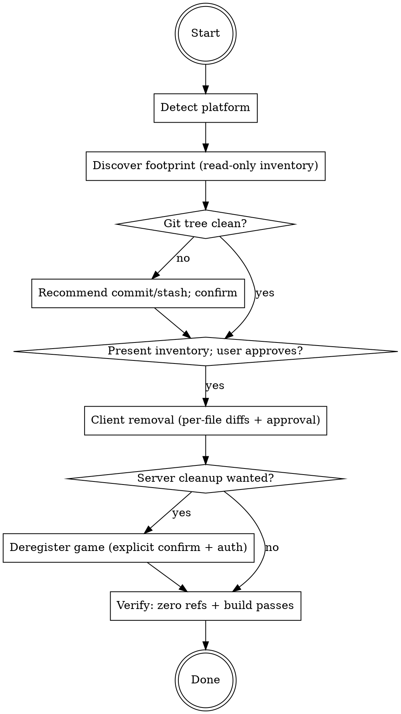

# MoonForge Uninstall

## Overview

Cleanly removes ALL MoonForge instrumentation from a game project: the SDK
files, the init/bootstrap wiring, every analytics and error-tracking call,
`.moonforge.json`, and `MOONFORGE_EVENTS.md` — leaving the game buildable.
Optionally deregisters the game from the MoonForge dashboard. The reverse of
`/moonforge`.

## When to Use

- User says "remove MoonForge", "uninstall analytics", or `/moonforge-uninstall`
- A trial or churned customer wants MoonForge fully out of their codebase
- A developer is reverting an instrumentation experiment

## Process Flow



## Platform routing

1. Determine the platform:
   - **Unity** — `Assets/` and `ProjectSettings/ProjectSettings.asset` present.
   - **Web** — `package.json` with a game framework dependency (`phaser`, `pixi.js`,
     `three`, `@babylonjs/core`, `playcanvas`, `kaboom`, `excalibur`, `matter-js`),
     or an `index.html` referencing a game bundle / `<canvas>`.
   - **Any other engine** — `generic`. Instrumentation written by the generic
     path is hand-written HTTP calls rather than an SDK, so removal is finding
     and deleting those calls plus the helper module they go through.
   - Ambiguous (both Unity and Web markers present): ask the user which to uninstall from.
2. Read `.moonforge.json` (if present) to capture `gameId`/`gameName` for the
   optional server step — BEFORE it gets deleted.
3. Load and follow the matching reference for the rest of this skill:
   - Generic → `references/generic.md`
   - Unity → `references/unity.md`
   - Web → `references/web.md`

## Universal rules (both platforms)

- **Inventory first, touch nothing.** Grep the project (excluding `node_modules/`,
  `dist/`, `build/`, `.next/`, `Library/`, `Temp/`, `.git/`) and present a
  structured inventory: SDK files, config, init wiring, every call site.
- **Git safety.** If `git status` shows a dirty tree, recommend the user commit or
  stash first so the removal is one reviewable, revertible diff. Proceed only on
  explicit confirmation.
- **Value-using references are NEVER auto-deleted.** A statement like
  `MoonForgeAnalytics.trackEvent(...)` is a side-effect call — safe to delete. But
  any reference whose RETURN VALUE is used (assigned, passed, returned, awaited
  into a variable — e.g. `const id = MoonForgeAnalytics.getDistinctId()`) changes
  program behavior if removed. Flag these with file:line in a "manual review"
  list and leave them in place unless the user resolves them.
- **Per-file diffs.** Show each file's change and get approval before applying,
  exactly like `/moonforge`'s implement flow.

## Server cleanup (opt-in)

Only offer if a `gameId` is known. Requires BOTH:
1. An explicit second confirmation (this is destructive and irreversible).
2. A MoonForge auth token (Bearer). If none is available, do NOT attempt the
   call — print the manual alternative instead (delete the game from the
   MoonForge dashboard, or run the curl below with a token).

```bash
curl -X DELETE "https://game.moonforge.co/api/games/<GAME_ID>" \
  -H "Authorization: Bearer <TOKEN>"
```

**Be explicit with the user:** this deregisters the game from the account and
dashboard. **Raw events already collected are retained** in the analytics store —
purging them is a separate owner-side operation this skill does not perform.

## Verify (always the last step)

1. Grep the project again — expect ZERO MoonForge references
   (`MoonForge`, `moonforge`) outside any flagged value-using references the user
   explicitly chose to keep. `.moonforge.json`, `MOONFORGE_EVENTS.md`, and the
   SDK files must be gone.
2. Build check per platform (see the reference file) — the game must still build.
3. Present a removal summary: files deleted, call sites removed, flagged items
   kept, server deregistration status.
