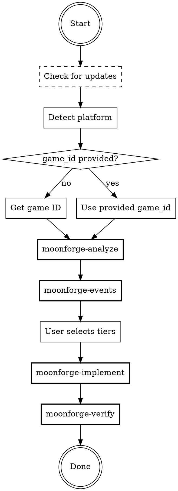

# MoonForge Analytics Instrumentation

## Overview

Interactive agent that guides game developers through analytics instrumentation,
whatever engine they use. Analyzes the game, recommends events by priority tier,
writes the tracking calls, and verifies everything works.

MoonForge's collector is a plain HTTP endpoint. Anything that can send an HTTP
POST can be instrumented. Every project ends up with an SDK inside it: web
copies the one bundled with this skill, Unity and every other engine have one
generated in their own language. Nothing has to be installed first, and there
is no engine this skill has to turn away.

## When to Use

- User wants to add analytics events to their game, on any engine
- User says "instrument my game" or "add analytics" for any game project
- Another agent receives a game ID and needs to add analytics

## Arguments

- **game_id** (optional): Pass directly to skip game detection. Example: `/moonforge 550e8400-e29b-41d4-a716-446655440000`

## Process Flow



### Step 1: Check for Updates

Best-effort, never blocking. Fetch the `version:` frontmatter from
`https://raw.githubusercontent.com/MoonForgeAI/moonforge-skill/main/skills/moonforge/SKILL.md`
and compare it to this file's own `version:` above.

- **Newer version available:** tell the user once, briefly — e.g. "MoonForge
  skill v&lt;remote&gt; is available (you have v&lt;installed&gt;)." — and ask whether they want to
  update now. If yes, follow this repo's `README.md` install instructions for
  whichever tool you are running as (`npx @moonforge/moonforge-skill <agent>` is the
  recommended path for Claude Code, Codex, Cursor, Copilot, and Windsurf; see
  the README's "Other AI Tools" section for anything else), then continue the
  flow on the version that was just running — do not re-invoke yourself
  mid-session. If no, or no answer needed, proceed immediately to Step 2.
- **Up to date, or the fetch fails/times out (offline, GitHub unreachable,
  rate-limited):** say nothing and proceed straight to Step 2. A version check
  must never stall or fail the actual instrumentation task — treat any error
  here as "skip and continue," not as a blocker to raise to the user.
- **Never auto-install.** Updating overwrites files outside the current
  project directory (the skills/commands folder for whichever tool is
  running this skill) — always get explicit confirmation first, exactly like
  any other change outside the project tree.

### Step 2: Detect Platform

Determine the `platform` for this project by checking the current directory:
- **Unity** — `Assets/` directory and `ProjectSettings/ProjectSettings.asset` present.
- **Web** — `package.json` with a game framework dependency (`phaser`, `pixi.js`,
  `three`, `@babylonjs/core`, `playcanvas`, `kaboom`, `excalibur`, `matter-js`),
  or an `index.html` referencing a game bundle / `<canvas>`.
- **Anything else** — `generic`. Unreal (`.uproject`), Godot (`project.godot`),
  LÖVE (`main.lua`), Bevy/Rust (`Cargo.toml`), MonoGame, a custom engine, or a
  game server all take this path. Do NOT tell the user their engine is
  unsupported — it is not. `moonforge-implement` generates a full SDK for their
  engine, in their language, against the same contract every platform meets.
- Ambiguous (both Unity and Web markers present): ask the user which to instrument.
- If nothing at all is recognisable: ask the user for the project path and which
  language the game is written in, then proceed as `generic`.

Set `platform` to `unity`, `web`, or `generic` and pass it to every sub-skill below.

### Step 3: Get Game ID

Priority order:
1. Passed as argument to this skill
2. Read from `.moonforge.json` if present in project root
3. Ask the user for their MoonForge game ID

If the user does not have one, do not stall — tell them exactly where to get it:

> Sign in at https://game.moonforge.co, create a game if you have not already,
> and copy its game ID from the game's settings. It is a UUID that looks like
> `550e8400-e29b-41d4-a716-446655440000`.

Validate what they give you: it must be a UUID. A non-UUID game id is the single
most common reason instrumentation appears to work and no data ever arrives —
the collector validates the field against a schema and rejects the event, and
returns a success status while doing it. Do not proceed with a value that is not
a UUID.

If the user wants to explore the flow before signing up, offer to run
`/moonforge:analyze` and `/moonforge:events` — both work fully without a game
ID. Only implement and verify need one.

### Step 4: Analyze

**REQUIRED SUB-SKILL:** Use moonforge-analyze, passing `platform`

Scan the project and present the game profile to the user.

### Step 5: Recommend Events

**REQUIRED SUB-SKILL:** Use moonforge-events, passing `platform`

Present tiered event recommendations. Wait for user to select tiers.

### Step 6: Implement

**REQUIRED SUB-SKILL:** Use moonforge-implement, passing `platform`

For each event in selected tiers, find the right file and method, write the TrackEvent call, and show diff for approval.

### Step 7: Verify

**REQUIRED SUB-SKILL:** Use moonforge-verify, passing `platform`

Run compilation check, static analysis, and present event inventory. Writes
`MOONFORGE_EVENTS.md` to the project root so the inventory survives after
this conversation ends.

## Quick Reference

| Sub-Skill | Purpose | Invocation |
|-----------|---------|------------|
| moonforge-analyze | Scan project structure | `/moonforge:analyze` |
| moonforge-events | Recommend events by tier | `/moonforge:events` |
| moonforge-implement | Write TrackEvent calls | `/moonforge:implement` |
| moonforge-verify | Check build + collector | `/moonforge:verify` |
| moonforge-uninstall | Remove all MoonForge instrumentation | `/moonforge-uninstall` |

## Full SDK API Reference — Unity (C#)

This section is the **Unity** SDK surface. For web, see the JS SDK API in
`moonforge-implement/references/web.md`. For any other engine, see
`moonforge-implement/references/generic.md`, which documents the wire protocol
these SDKs speak so it can be reimplemented in any language.

Namespace: `MoonForge.ErrorTracking.Analytics`

### Analytics (TrackEvent / TrackScreenView / Identify / SetUserProperty)

```csharp
using MoonForge.ErrorTracking.Analytics;
using System.Collections.Generic;

// Track a custom event
MoonForgeAnalytics.TrackEvent("event_name", new Dictionary<string, object>
{
    { "key", value }
});

// Track a screen view
MoonForgeAnalytics.TrackScreenView("screen_name");

// Identify a user (for games with user accounts)
MoonForgeAnalytics.Identify("user_id", new Dictionary<string, object>
{
    { "trait_key", value }
});

// Set persistent user property (included in all subsequent events)
MoonForgeAnalytics.SetUserProperty("key", value);
```

### Error Tracking (MoonForgeErrorTracker singleton)

```csharp
using MoonForge.ErrorTracking;

// Set current user for error context
// SetUser(string userId, Dictionary<string, string> tags = null)
MoonForgeErrorTracker.Instance.SetUser("user_123", new Dictionary<string, string>
{
    { "email", "user@example.com" },
    { "displayName", "UserName" }
});
MoonForgeErrorTracker.Instance.ClearUser();

// Game state context (attached to error reports)
// SetGameState(string sceneName = null, string gameMode = null, string levelId = null)
MoonForgeErrorTracker.Instance.SetGameState(sceneName: "Arena", gameMode: "Ranked", levelId: "5");
// Arbitrary custom state data — one key/value per call
MoonForgeErrorTracker.Instance.SetGameStateData("score", 1200);

// Manual breadcrumbs for debugging context
// AddBreadcrumb(string message, BreadcrumbType type = User, BreadcrumbLevel level = Info, string category = null)
MoonForgeErrorTracker.Instance.AddBreadcrumb("Player picked up item", BreadcrumbType.User,
    BreadcrumbLevel.Info, "inventory");

// Capture exceptions manually
// CaptureException(Exception, ErrorLevel level = Error, Dictionary<string, string> tags = null)
try { /* ... */ }
catch (Exception ex)
{
    MoonForgeErrorTracker.Instance.CaptureException(ex, ErrorLevel.Error,
        new Dictionary<string, string> { { "context", "inventory_load" } });
}

// Capture a custom message
MoonForgeErrorTracker.Instance.CaptureMessage("Something unexpected", ErrorLevel.Warning);

// Flush pending events before shutdown
MoonForgeErrorTracker.Instance.Flush();
```

### Network Error Tracking

```csharp
using MoonForge.ErrorTracking;
using MoonForge.ErrorTracking.Capture;

// Option A: Extension method on UnityWebRequest
var request = UnityWebRequest.Get("https://api.example.com/data");
yield return request.SendWithTracking();  // auto-tracks errors

// Option B: Manual tracked request via NetworkErrorInterceptor (static class — no .Instance)
yield return NetworkErrorInterceptor.SendTrackedRequest(
    request, "api_data_fetch");

// Option C: Manual error reporting
NetworkErrorInterceptor.ReportError(
    "https://api.example.com/data", 500, "Internal Server Error",
    "GET", "api_data_fetch");
```

### Enums

```csharp
// Error severity levels
enum ErrorLevel { Info, Warning, Error, Fatal }

// Breadcrumb categories
enum BreadcrumbType { Navigation, Network, User, Debug, Error }

// Breadcrumb severity
enum BreadcrumbLevel { Debug, Info, Warning, Error, Fatal }
```

### MoonForgeSettings (ScriptableObject in Resources/)

| Field | Type | Default | Description |
|-------|------|---------|-------------|
| gameId | string | — | MoonForge game UUID (required) |
| enabled | bool | true | Master kill switch |
| enableInEditor | bool | true | Track in Unity Editor |
| debugMode | bool | false | Verbose console logging |
| enableAnalytics | bool | true | Enable analytics pipeline |
| trackSceneViewsAutomatically | bool | true | Auto-track scene changes |
| sessionTimeoutSeconds | int | 1800 | Inactivity timeout for new session |
| maxBreadcrumbs | int | 50 | Ring buffer size for breadcrumbs |
| enableNetworkErrorTracking | bool | true | Track UnityWebRequest errors |
| errorStatusCodeThreshold | int | 400 | HTTP status >= this is an error |
| captureConnectionErrors | bool | true | Track DNS/TLS/connection failures |
| captureHttpErrors | bool | true | Track HTTP error responses |
| addBreadcrumbsForAllRequests | bool | false | Breadcrumb every request, not just errors |

## Auto-Tracked (P0) — No Code Needed

Applies to every platform. `moonforge-implement` puts an SDK in the project
before instrumenting — bundled on web, generated on Unity and everywhere else —
and all of them implement the session lifecycle. Either way the user
instruments P1 and up, never P0.

The SDK automatically tracks when initialized:
- `session_start` — on init with `{ session_id }`
- `session_end` — on shutdown with `{ session_id, duration_seconds }`
- Session re-engagement after `sessionTimeoutSeconds` of inactivity
- Scene changes via `TrackScreenView` on `SceneManager.sceneLoaded`
- Unhandled exceptions, Unity log errors, native crashes (separate error pipeline)

**Auto-collected fields on EVERY event (never duplicate in custom properties):**
`game`, `id` (user UUID), `screen` (resolution), `language`, `url` (current scene), `title` (scene name), `referrer` (previous scene), `timestamp`, `appVersion` (the game's own version, not this skill's)

## .moonforge.json Format

```json
{
  "accountId": "uuid",
  "accountName": "Team Name",
  "gameId": "uuid",
  "gameName": "My Game",
  "sdkConfigured": true
}
```

## MOONFORGE_EVENTS.md

Written by `moonforge-verify` at the end of Step 7 — the event inventory,
saved to the project root, grouped by tier. Regenerated (full overwrite) on
every verify run; format and rules in
`moonforge-verify/references/event-inventory-export.md`. Deleted by
`moonforge-uninstall` alongside `.moonforge.json`.
